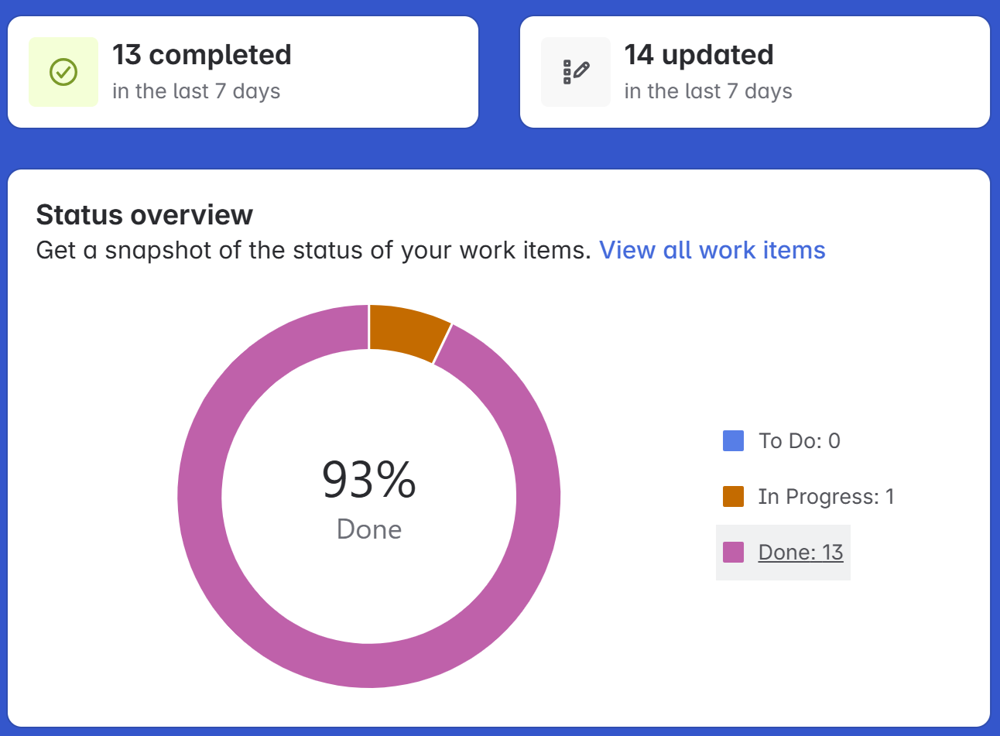
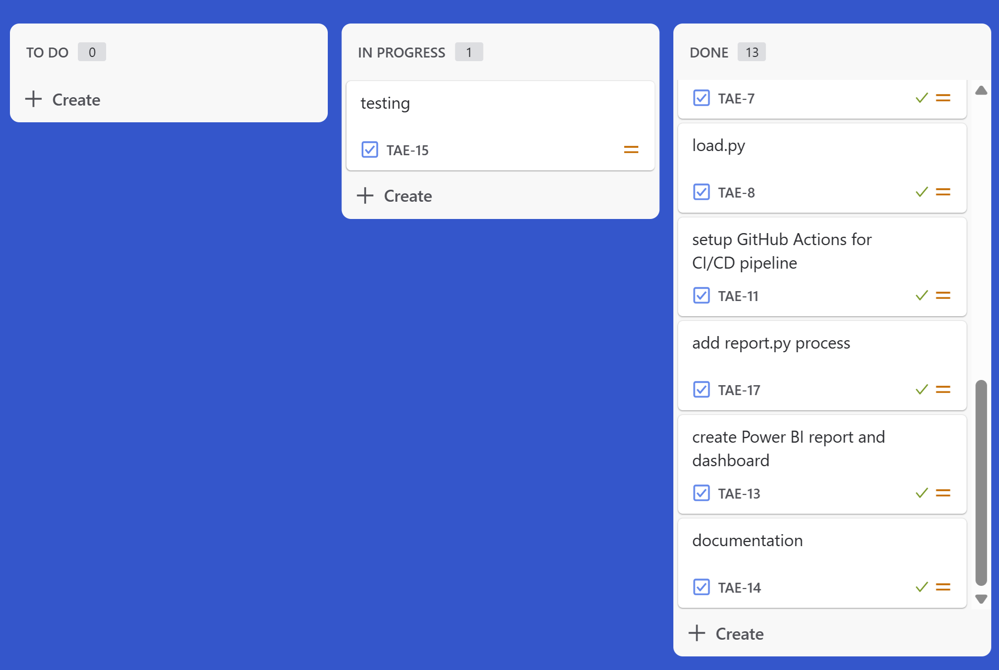
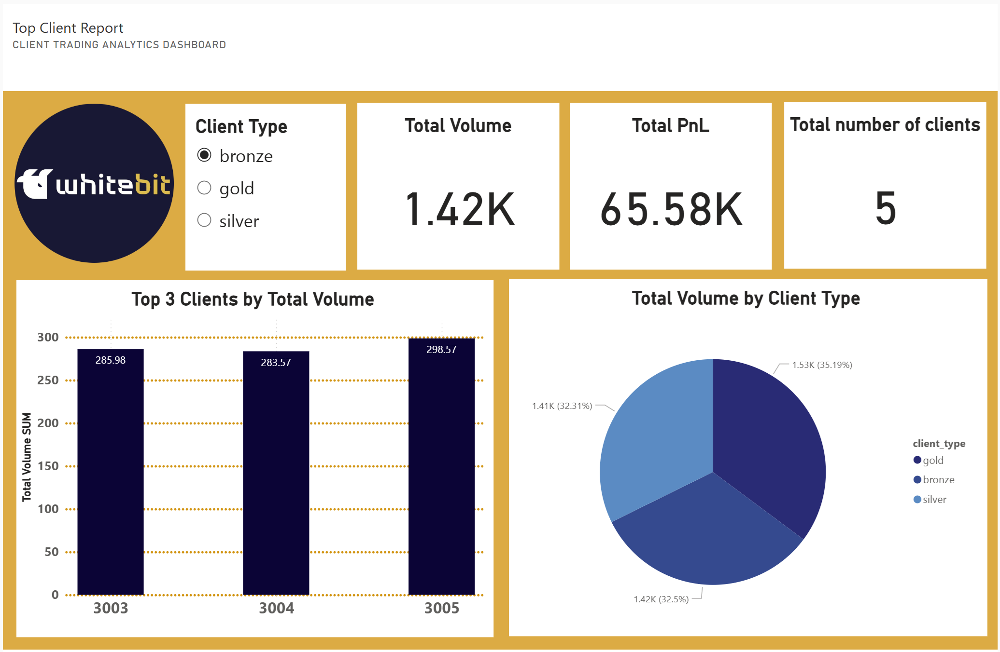

# ETL Pipeline for Client Trades Analytics

## Overview

This project implements an end-to-end ETL pipeline for processing client trading data. The pipeline ingests raw trade records from a CSV file, aggregates key metrics weekly by client and instrument, loads results into a database, and supports data analytics and reporting. Automation is provided via CI/CD with GitHub Actions, and the solution is designed with scalability in mind.

---

## Table of Contents

- [Overview](#overview)
- [Main Tools & Technologies Used](#main-tools--technologies-used)
- [Instructions: How to Run the Project](#instructions-how-to-run-the-project)
  - [How to Launch ETL via GitHub Actions](#how-to-launch-etl-via-github-actions)
  - [How to Run This Project Locally](#how-to-run-this-project-locally)
- [Project Structure](#project-structure)
- [Development Process & Project Management](#development-process--project-management)
- [ETL Pipeline Description](#etl-pipeline-description)
- [Visualization & Reporting](#visualization--reporting)
- [Scalability & Architecture](#scalability--architecture)
- [Author](#author)

---

## Main Tools & Technologies Used

- **Jira** – for planning, creating, prioritizing, and tracking project tasks
- **Power BI Desktop** – for building interactive analytical dashboards
- **Power BI Service** – for publishing, sharing, and online visualization of dashboards
- **Visual Studio Code** – primary code development environment
- **GitHub** – code hosting, team collaboration, version control
- **GitHub Actions** – CI/CD, automation of ETL pipeline execution and checks
- **Python** – primary language for ETL scripts and reporting automation
- **SQLite** – lightweight relational database for storing aggregated results
- **CSV/Excel** – formats for input and output data
- **.env files** – for environment variables management

_Additional Python libraries used: pandas, openpyxl._

---

## Instructions: How to Run the Project

<details>
<summary><strong>How to Launch ETL via GitHub Actions</strong></summary>

<br>

You can run this ETL pipeline entirely in the cloud via GitHub Actions, without installing Python or dependencies locally.

1. **Fork the Repository to Your GitHub Account**
    - Click “Fork” at the top-right of the repository page to create a copy in your account.

2. **Add or Replace the Input File**
    - In your fork, upload your `trades.csv` (or the required input file) into the `income_files` directory.
    - You can do this by clicking “Add file” → “Upload files”.
    - NOTE: file mask is trades*.csv

3. **Trigger the ETL Workflow**
    - Go to the **Actions** tab in your forked repo.
    - Find the workflow named **ETL CI**.
    - Click it, then click **Run workflow** (this uses workflow_dispatch and allows manual start).
    - Alternatively, push any commit (for example, updating the input file) to automatically trigger the workflow.

4. **Wait for the Workflow to Complete**
    - The ETL pipeline will run: extract, transform, load and report scripts.
    - Workflow logs and status will be visible in the Actions tab.

5. **Download the Results**
    - After workflow completion, scroll down to the “Artifacts” section of the workflow run.
    - Download files such as:
        - `db/agg_result.db` (aggregated database)
        - `log/extract.log`, `log/transform.log`, `log/load.log` (etl logs)
        - `reports/top_clients.xlsx` (top bronze clients report)

6. **View the Dashboard**
    Open the Power BI file `images/Top Client Report.pbix` to visualize the data.

> **Note:**  
> No local installation is required — all processing is done in GitHub Actions cloud runners.

</details>

---

<details>
<summary><strong>How to Run This Project Locally</strong></summary>

<br>

Follow these steps to launch the ETL pipeline and analytics on your own machine.

1. **Clone the Repository**
    ```bash
    git clone https://github.com/NelliYanchuk/trade-analytics-etl-tech-task.git
    cd trade-analytics-etl-tech-task
    ```

2. **Set Up the Python Environment**
    It is recommended to use a virtual environment:
    ```bash
    python -m venv venv
    source venv/bin/activate  # On Windows use: venv\Scripts\activate
    ```

3. **Install Required Dependencies**
    ```bash
    pip install -r requirements.txt
    ```

4. **Place the Input File**  
    Ensure that the file `trades.csv` is present in the `LOCAL_INPUT_PATH` = `income_files` directory.  
    Alternatively, you can set the `LOCAL_INPUT_PATH` environment variable to any local file path you want to use as the input for analysis, and set `LOCAL_OUTPUT_PATH` for archiving the original file.  
    If your file has a different name, either rename it to `trades*.csv` or update the FILE_MASK environment variable accordingly.

5. **Run the ETL Pipeline**
    You can run the entire ETL process with the following commands:
    ```bash
    python etl/extract.py
    python etl/transform.py
    python etl/load.py
    python report_scripts/top_3_bronze_report.py 
    ```

6. **Check the Results**

    | Directory      | Contents                                                                              |
    |----------------|---------------------------------------------------------------------------------------|
    | `input/`       | Your original input file(s), `trades.csv`                                             |
    | `output/`      | The aggregated CSV file(s), `agg_trades.csv`                                          |
    | `log/`         | ETL process logs, `extract.log`, `transform.log`, `load.log`                          |
    | `db/`          | The aggregated results as a SQLite database, `agg_result.db`                          |
    | `reports/`     | The top-3 bronze clients report as an Excel file, `top_clients.xlsx`                  |
    | `archive_files/` | Processed input files with current date postfix, `trades_20250728.csv`              |

7. **View the Dashboard**
    Open the Power BI file `images/Top Client Report.pbix` to visualize the data.

</details>

---

## Project Structure

```
├── .github/
│   └── workflows/
│       └── etl-ci.yml
├── .venv/
├── archive_files/
│   └── trades_20250728.csv
├── db/
│   └── agg_result.db
├── etl/
│   ├── extract.py
│   ├── load.py
│   └── transform.py
├── images/
│   ├── jira_board.png
│   ├── jira_summary.png
│   ├── TOP Client Report.pbix
│   └── whitebit_dashboard.png
├── income_files/
│   └── trades.csv
├── input/
│   └── trades.csv
├── log/
│   ├── extract.log
│   ├── load.log
│   └── transform.log
├── output/
│   └── agg_trades.csv
├── report_scripts/
│   └── top_3_bronze_report.py
├── reports/
│   └── top_clients.xlsx
├── .env
├── .env.example
├── .gitignore
├── README.md
├── requirements.txt
└── TASK.txt
```

---

## Development Process & Project Management

- **Task Management:**  
  The development process was organized using Jira. The project was broken down into user stories and tasks, including ETL design, modular coding (extract/transform/load), testing, CI/CD setup, and dashboard/report creation. Progress was tracked and regularly updated in the Jira board.

  **Key Jira tasks included:**
  - Creating initial project plan and backlog
  - Designing ETL pipeline structure
  - Developing extract, transform, and load modules
  - Setting up SQLite database and output logic
  - Implementing CI/CD with GitHub Actions
  - Preparing analytics dashboard in Power BI
  - Generating top-clients report

        

- **Branching Strategy:**  
  The codebase used a simple Git Flow branching model. Each logical feature or task was developed in a dedicated branch, reviewed, and merged into `develop`, and then into `main` upon completion.

```
main
  │
  ├─ dev
  │    ├─ feature/setup_docs 
  │    ├─ feature/task.md 
  │    ├─ feature/extract 
  │    ├─ feature/transform 
  │    ├─ feature/load
  │    ├─ feature/ci_cd
  │    ├─ wip/ci_cd
  │    |    └─ wip/extract_transform_log_file
  │    ├─ feature/top_report
  │    └─ feature/readme
  └─ hotfix/load_log_header
```
  This ensured code quality, easy collaboration, and a clear project history.

---

## ETL Pipeline Description

1. **Extract**  
   - Reads raw `trades.csv` by mask and checks the required columns: `timestamp, user_id, client_type, symbol, side, quantity, price`.

2. **Transform**  
   - Checks correct date and number columns types
   - Cleans dataset from the rows that contain nan and not_a_date values
   - Converts `timestamp` to `week_start_date` (Monday of each week) and resets the time to 00:00:00 for correct aggregation.
   - Aggregates data by:  
     - `week_start_date`  
     - `client_type` (`gold`, `silver`, `bronze`)  
     - `user_id`  
     - `symbol`
   - Calculates for each group:  
     - `total_volume` (sum of `quantity * price`)  
     - `total_pnl` (sum of `quantity * price * (1 if side == 'sell' else -1')`)  
     - `trade_count` (count of trades)

3. **Load**  
   - Writes aggregated results into SQLite database `db/agg_result.db`, table `agg_trades_weekly`.

4. **Reporting**
   - Generates a top-3 bronze clients report using `report_scripts/top_3_bronze_report.py`, saved in `reports/top_clients.xlsx`.

---

## Visualization & Reporting

- **Power BI Dashboard**  
  - Example dashboard screenshot is available in the `images/` folder `whitebit_dashboard.png` or you can load and explore full Power BI dashboard from the `Top Client Report.pbix` file.  

    

- **Top 3 Bronze Clients**  
  - The script generates `reports/top_clients.xlsx` with the top-3 bronze clients by `total_volume` and `total_pnl`.

---

## Scalability & Architecture

**How to adapt for 100+ million rows**


---

## Author

Prepared by Nelli Yanchuk  
- [GitHub](https://github.com/NelliYanchuk)  
- [LinkedIn](https://www.linkedin.com/in/nelli-yanchuk)

---
